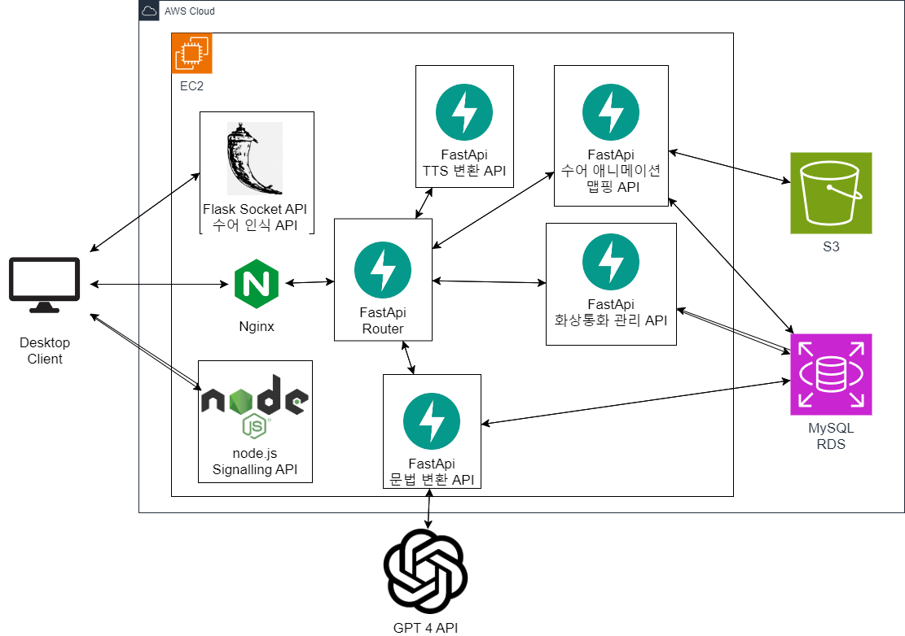

# 물음표
> 수어 사용자와 구어 사용자가 실시간으로 소통할 수 있는 양방향 통역 영상통화 서비스를 개발했습니다.  
> 사용자가 카메라 앞에서 수어를 사용하면 수어 단어들을 인식하여 텍스트로 변환 후 자연스러운 구어 음성으로 만들어 들려드립니다.  
> 또한, 사용자가 구어를 사용하면 텍스트로 변환 후 수어로 사용되는 단어들로 변환 후 수어 애니메이션을 조합하여 재생해줍니다.

### 기대 효과
> 농인과 수어를 모르는 사람과의 의사소통을 도움으로써 농인과의 의사소통 문제를 해결할 수 있습니다.  
> 이를 활용한다면 공공기관, 교육, 의료 등 많은 곳에서 농인들이 더욱 편하고 합리적인 서비스를 받을 수 있을 것으로 기대합니다.

  

## 주요 기능
- 1:1 실시간 영상통화 기능을 제공합니다.
- 수어 모션을 실시간으로 인식하여 음성으로 통역하는 기능을 제공합니다.
- 음성을 적절한 수어 애니메이션으로 변환하여 통역해주는 기능을 제공합니다.

  

## 기술 스택
- Server
  - Python 3
  - FastAPI
  - Flask Socket IO
  - node.js
- Client
  - ReactJS 18.2.0
  - socket.io-client 4.6.2
- Testing
  - Postman
- DB
  - MySQL
- DevOps
  - AWS EC2 (Ubuntu)
  - AWS RDS
  - AWS S3
  - Nginx
  - Github
- Communication
  - Notion

  

## Backend System Architecture

  

## 구현 기능
> 제가 구현한 기능을 `표시`했습니다.

 

#### 애플리케이션 서버
- 애플리케이션 서버 
  - `라우팅 API`
    - 비즈니스 로직에 맞추어 각 기능의 API를 호출합니다.
  - TTS API
    - 텍스트를 음성 파일로 변환하여 AWS S3에 업로드하고 DB에 정보를 저장합니다.
  - `문법 변환 API`
    - Chat GPT를 사용하여 구어와 수어간의 문법을 변환하여 응답합니다.
  - 수어 애니메이션 맵핑 API
    - 수어 단어 텍스트에 맞게 AWS S3에 업로드된 수어 애니메이션 정보를 DB에서 가져와 응답합니다. 
  - `화상통화 관리 API`
    - 화상통화를 위해 필요한 DB 데이터를 응답합니다.
- 클라이언트
  - `1대1 영상통화`
    - WebRTC P2P 방식의 연결을 통해 영상통화를 제공합니다.
  - 웹 페이지 구성
- 실시간 수어 인식 서버
  - 웹캠을 통해 인식되는 수어를 단어로 변환하여 수어 인식이 종료되면 애플리케이션 서버로 변환 요청을 보냅니다.
- `Signalling Server`
  - 두 사용자의 WebRTC 연결을 위한 데이터를 주고 받도록 도와주고 화상통화 방을 생성합니다.

  

## 실제 화면
- 말한 내용을 인식하여 밑에 텍스트로 출력해줄 뿐만 아니라 카메라 하단에 수어 애니메이션이 나와 농인이 알아 볼 수 있도록 합니다.
  

- 수어 행위자의 수어를 인식하여 단어들을 추출하고 GPT모델을 통하여 자연스러운 문장으로 만든 후 TTS를 만들어 mp3파일을 s3 버킷에 저장후 상대방에게 음성으로 수어 내용을 전달합니다.
  

- 수어와 구어의 문법 변환
  

